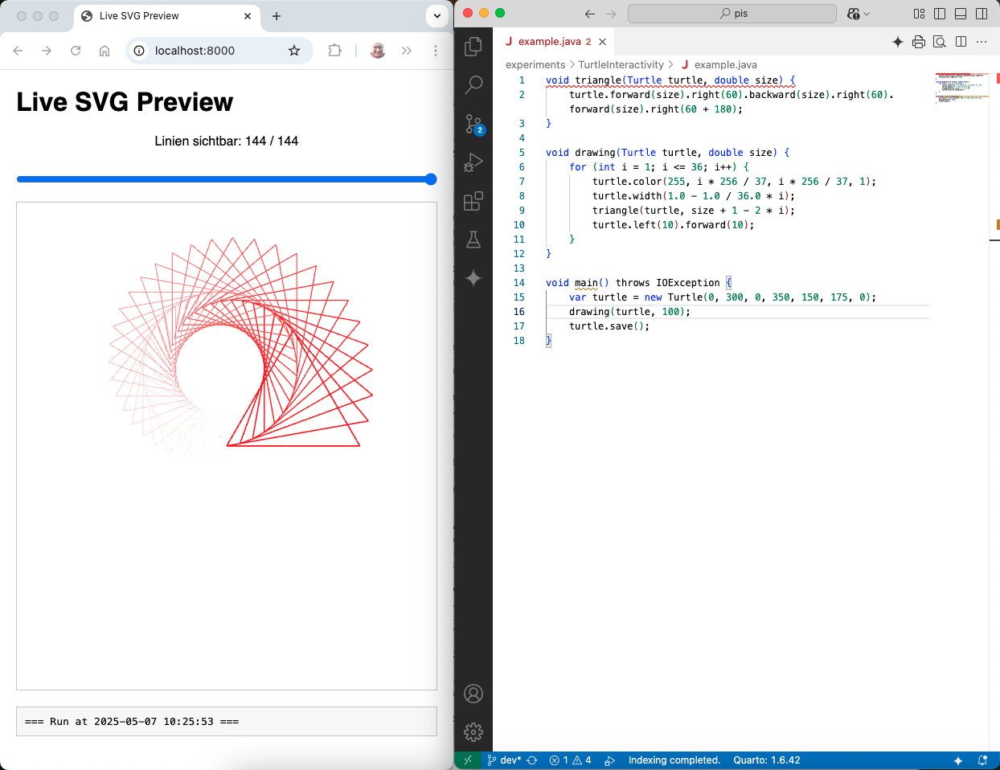

# Java Coding mit Live Reloading

Dieses Projekt realisiert einen Prototypen zur Java-Programmentwicklung mit Live Reloading.

🔁 Das **Live Reloading** ist eine Technik, die Dateien beobachtet und bei jeder Änderung die komplette Anwendung neu lädt und ausführt. Sehr oft agiert ein Webbrowser als Frontend, der damit ein Refresh erfährt.

Der Prototyp demonstriert die Anwendung dieser Technik für die Programmierung von Turtle-Grafiken.

🐢 Für die Erzeugung einer **Turtle-Grafik** steuert man eine "Schildkröte" über eine Zeichenfläche, indem man ihr Befehle wie "vorwärts" oder "drehe links" gibt. Dabei hinterlässt sie Linien.

> **Disclamer**: Bei der Entwicklung des Prototypen habe ich ausgiebig KI-basierte Programmier-Assistenz in Anspruch genommen: ChatGPT o4-mini-high hat den Großteil des Codes verfasst, der Gemini Coding Assistent für Visual Studio Code hat mit kleineren Hilfestellungen beigetragen.

## Motivation

Es hat seinen ganz eigenen Reiz, wenn man Programme mit Grafik schreibt und Programmänderungen unmittelbar in der Grafikausgabe zu sehen sind. Dahinter steckt die Idee des Live Coding mit unmittelbarem Feedback für interaktives, explorierendes Entwickeln.

🎹 **Live Coding**: Der Akt, Code in Echtzeit zu schreiben und dabei sofort die Auswirkungen zu sehen – ideal für Lehre, kreative Experimente oder visuelle Rückmeldungen.

⚡ **Instant Feedback**: Das unmittelbare visuelle oder funktionale Feedback bei jeder Code-Änderung. Sehr wertvoll für das schnelle Lernen, Fehlersuche oder kreatives Experimentieren.

🌀 **Interaktive Entwicklung / Explorative Programmierung**: Ein Stil des Programmierens, bei dem man nicht streng planvoll, sondern eher ausprobierend und visuell gesteuert vorgeht – besonders geeignet für kreative, grafische oder simulationsbasierte Projekte.

Diese Ideen stehen im Zentrum vieler moderner Entwicklungsumgebungen – von Scratch über Processing bis hin zu Web-Playgrounds mit JavaScript oder WebAssembly.

> Eine eigene Art der Umsetzung des Live Codings verfolge ich mit dem [Live View Programming](https://github.com/denkspuren/LiveViewProgramming), die auf die Verwendung der JShell zum Coden ausgerichtet ist.

Leider zeigt sich mit der Entwicklung von Java, dass die JShell bei Programmen mit Records und sealed Interfaces gelegentlich mit Fehlermeldungen aussteigt – obwohl das Programm mit `java` erfolgreich ausgeführt werden kann. Ohne die JShell geht allerdings eine gewisse Interaktivität und Explorativität verloren.

> Dieser Prototyp zeigt, wie man die Idee des Live View Programming auch mit "reinem" Java mit einer Umsetzung des **Live Reloading** realisieren kann.

Dabei greife ich auf ein Preview-Feature von Java 24 zurück, das mit Java 25 standarmäßig verfügbar sein wird: Compact Source Files and Instance Main Methods (siehe [JEP 512](https://openjdk.org/jeps/512); in dem Preview in Java 24 heißt es noch Simple Source Files in [JEP 495](https://openjdk.org/jeps/495)).

# Prototyp-Demo



## Vorbereitung

**Aktuelles Java JDK installieren**:

Es wird davon ausgegangen, dass Sie das aktuelle Java 24 JDK installiert haben.

**Repository clonen**

Ebenso wird davon ausgegangen, dass Sie `git` installiert haben.

```
git clone https://github.com/IhrUsername/java-live-reload.git
cd java-live-reload
```

## Ausprobieren

**Server starten**:

```
% java DevServer.java example.java --log
Watching example.java…
Server läuft auf http://localhost:8000
```

Öffnen Sie die angegebene Webseite im Webbrowser.

**Java-Code im Editor öffnen und ändern**:

1. Öffnen Sie im Editor Ihrer Wahl die Datei `example.java` und entfernen Sie beispielsweise ein Semikolon und speichern Sie das Ergebnis.

2. Im Live Preview wird Ihnen ein Kompilierfehler unter dem Bild angezeigt.

3. Fügen Sie das Semikolon wieder ein und speichern Sie das Ergebnis erneut.

4. Jetzt sollten Sie einen erfolgreichen Kompiliervorgang sehen.

5. Nutzen Sie den Slider, um sich den schrittweisen Aufbau der Turtle-Grafik anzuschauen.

6. Ändern Sie den Turtle-Code, experimentieren Sie mit der Erstellung einer eigenen Grafik.

## Übersicht

In dem Verzeichnis finden sich folgende, für die Programmierung bzw. Ausführung relevanten Dateien:

```
.
├── console.log
├── DevServer.java
├── example.java
├── index.html
├── output.svg
└── Turtle.java
```

* `DevServer.java`: Ein einfacher HTTP-Server mit Server Sent Events (SSE) samit Dateiüberwachung (WatchService) einer Java-Datei. Stößt die Ausführung der Datei an, wenn sich die Datei ändert.

  **Aufruf**:
  
  ```bash
  java DevServer.java IhreDatei.java [port] [--log]
  ```

  * `IhreDatei.java`: Die überwachte und auszuführende Java-Datei
  * Optionale `port`-Angabe für den Server
  * Optionale Logging-Ausgaben mit `--log`

  Der Server gibt an, unter welcher Adresse der Webbrowser zur Betrachtung der Ausgabeergebnisse geöffnet werden muss; regulär ist das `http://localhost:8000/`

* `index.html`: Das ist die Webseite, die der Browser anzeigt, wenn er mit `http://localhost:8000/` nach dem Server-Start aufgerufen wird. Diese Datei bindet `output.svg` und `console.log` ein, um die Ergebnisse aus diesen Dateien anzuzeigen.

* `console.log`: In diese Datei protokolliert der Server die Ausgaben des Versuchs, die Java-Datei `IhreDatei.java` auszuführen.

* `Turtle.java`: Der Code, um Turtle-Grafiken erstellen zu können und als SVG-Datei zu speichern.

* `output.svg`: Der SVG-Code wird von `Turtle.java` in diese Datei geschrieben.

* `example.java`: Ein Beispiel zur Erstellung einer Turtle-Grafik.

